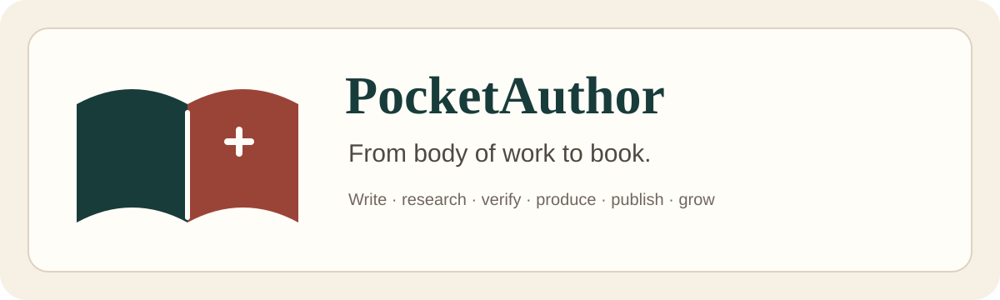

<div align="center">



# PocketAuthor

### From body of work to book.

**Turn years of expertise, research, notes, talks, interviews, and lived experience into a finished book — then turn that book into a durable intellectual asset.**

PocketAuthor is an AI-assisted authoring and book-production platform for founders, experts, creators, researchers, educators, consultants, ghostwriters, editors, publishers, and other book professionals.

[Website](https://www.pocketauthor.com) · [Open the app](https://app.pocketauthor.com) · [Explore features](https://www.pocketauthor.com/features) · [Public repo](https://github.com/Pocket-Author/PocketAuthor-Public) · [Socials](https://www.pocketauthor.com/socials)

</div>

---


## What we are building

A book should not begin as an isolated prompt or end as a single document.

PocketAuthor connects the full author journey:

```text
source material
      ↓
book opportunity
      ↓
Book Blueprint
      ↓
outline + research
      ↓
manuscript
      ↓
editing + provenance
      ↓
publishing readiness
      ↓
ebook + print editions
      ↓
distribution + launch
      ↓
book-to-business + next title
```

The goal is a workspace where authors can move from scattered knowledge to a coherent, trustworthy, professionally prepared book without losing the sources, decisions, collaborators, approvals, and production details behind it.

> **AI should make the work around authorship easier — not make authorship less meaningful.**

## Start here

| I want to… | Go here |
| --- | --- |
| Try PocketAuthor | [pocketauthor.com](https://www.pocketauthor.com) |
| Start writing | [app.pocketauthor.com](https://app.pocketauthor.com) |
| Understand the product | [Features](https://www.pocketauthor.com/features) |
| Learn how to publish | [How to publish](https://www.pocketauthor.com/how-to-publish) |
| Learn a specific book workflow | [Book Skills Library](https://www.pocketauthor.com/skills) |
| Find grants and funding | [Writing grants](https://www.pocketauthor.com/grants) |
| Find literary events | [Events](https://www.pocketauthor.com/events) |
| Find publishers | [Publisher directory](https://www.pocketauthor.com/publisher-directory) |
| Find bookstores | [Bookstore directory](https://www.pocketauthor.com/stores) |
| Find book professionals | [Book professionals](https://www.pocketauthor.com/book-professionals) |
| Explore book ideas by profession | [Professions](https://www.pocketauthor.com/profession) |
| Browse book types | [Book types](https://www.pocketauthor.com/book-types) |
| Understand copyright and permissions | [Copyright](https://www.pocketauthor.com/copyright) |
| Follow product/community updates | [Social hub](https://www.pocketauthor.com/socials) |
| Contribute publicly | [PocketAuthor-Public](https://github.com/Pocket-Author/PocketAuthor-Public) |

## Your book may already exist in pieces

The raw material may already be in your:

- notes and unfinished drafts
- client-safe frameworks and internal memos
- research and fieldwork
- podcasts and interviews
- talks, workshops, courses, and slide decks
- newsletters, essays, and long-form posts
- company history and operating lessons
- lived experience and family archives
- recurring questions people keep asking you

PocketAuthor is built to help find the book inside that body of work, structure it, verify it, finish it, and prepare it for readers.

## Who PocketAuthor is for

### Founders and operators
Turn hard-earned lessons, category insight, product decisions, failures, memos, and operating frameworks into a durable book.

### Experts, consultants, and coaches
Transform years of client work, teaching, frameworks, presentations, and repeatable methods into a professional book.

### Creators
Turn podcasts, videos, newsletters, essays, and a fragmented content archive into one coherent body of thought.

### Researchers and educators
Move from papers, lectures, interviews, datasets, field notes, and curriculum into accessible long-form work without abandoning evidence.

### Memoir and legacy authors
Organize interviews, journals, photographs, chronology, family history, and private archives into a lasting narrative.

### Ghostwriters, editors, and publishers
Coordinate source libraries, author voice, milestones, approvals, editorial handoffs, production readiness, editions, and repeat-title workflows.

## What makes the system different

**The manuscript is canonical.** Editions and exports derive from structured source content instead of becoming disconnected files.

**Evidence stays attached.** Claims, citations, provenance, permissions, and approvals should remain connected to the work.

**An edition is more than a download.** Paperback, hardcover, ebook, audiobook, accessible, translated, and future editions can have different identifiers, specifications, economics, and rights.

**Automation remains reviewable.** High-consequence publishing, legal, financial, rights, and model-assisted actions should keep a human approval path.

**Authors retain ownership.** PocketAuthor does not take ownership of original manuscripts.

**Provider status must be truthful.** A local readiness check is not represented as retailer acceptance, completed distribution, or guaranteed placement.

## Explore the author ecosystem

PocketAuthor is growing beyond the manuscript editor into an author ecosystem:

**make the book → make it trustworthy → make it publishable → find the people, funding, events, publishers, bookstores, and readers around it**

### Write, research, and produce
- [Writing workspace](https://app.pocketauthor.com)
- [Features](https://www.pocketauthor.com/features)
- [Author guides](https://www.pocketauthor.com/guides)
- [Book Skills Library](https://www.pocketauthor.com/skills)
- [Publishing calculators](https://www.pocketauthor.com/calculators)
- [Cover Studio](https://www.pocketauthor.com/cover-studio)
- [Production](https://www.pocketauthor.com/production)

### Discover opportunities
- [Writing grants & author funding](https://www.pocketauthor.com/grants)
- [Literary events](https://www.pocketauthor.com/events)
- [Publisher directory](https://www.pocketauthor.com/publisher-directory)
- [Bookstores](https://www.pocketauthor.com/stores)
- [Book clubs](https://www.pocketauthor.com/book-clubs)
- [Literary organizations](https://www.pocketauthor.com/organizations)
- [Rights network](https://www.pocketauthor.com/rights-network)
- [Marketplace](https://www.pocketauthor.com/marketplace)

### Turn one book into more
- [Course Studio](https://www.pocketauthor.com/course-studio)
- [Podcast](https://www.pocketauthor.com/podcast)
- [Trends](https://www.pocketauthor.com/trends)
- [Blog](https://www.pocketauthor.com/blog)

## Our GitHub repositories

### [PocketAuthor](https://github.com/Pocket-Author/PocketAuthor)
The active product codebase and engineering workspace. It includes the Next.js web app, Expo mobile work, publishing-domain packages, Supabase migrations, tests, release tooling, documentation, marketing systems, and brand assets.

### [PocketAuthor-Public](https://github.com/Pocket-Author/PocketAuthor-Public)
The public-facing knowledge, positioning, workflow, roadmap, acquisition, persona, and community repository. This is the best GitHub starting point for people learning what PocketAuthor is building or contributing to public documentation.

### [.github](https://github.com/Pocket-Author/.github)
This organization profile plus shared community-health files and contributor onboarding.

## Contributing

We welcome useful, reviewable contributions—especially around author workflows, accessibility, publishing knowledge, testing, documentation, directories, data quality, and product usability.

A good contribution usually starts with one of these:

1. Read [CONTRIBUTING.md](https://github.com/Pocket-Author/.github/blob/main/CONTRIBUTING.md).
2. Browse the [public repository](https://github.com/Pocket-Author/PocketAuthor-Public).
3. Check existing issues before opening a duplicate.
4. For a bug, include reproducible steps and the affected route/environment.
5. For public data, include a source and a way to verify freshness.
6. Keep pull requests narrow enough to review confidently.
7. Never commit credentials, private manuscripts, personal data, copyrighted source text you cannot redistribute, or third-party secrets.

### Areas where contributors can help

- public author and publishing guides
- bookstore, publisher, event, grant, and literary-organization data quality
- accessibility and inclusive publishing workflows
- international publishing research
- source provenance and citation UX
- author onboarding and education
- documentation and examples
- QA, regression tests, responsive behavior, and browser coverage
- design systems and editorial UX
- responsible AI authorship workflows
- localization and translation
- book production, EPUB, print, metadata, and accessibility standards

## Responsible AI authorship

PocketAuthor is being built around a simple principle:

### AI should strengthen authorship, not obscure it.

A serious authoring system should make it easier to ask:

- Where did this claim come from?
- What still needs verification?
- What is a quotation?
- What came from an interview?
- What is the author's direct experience?
- What needs attribution or permission?
- What did AI suggest?
- What did the author approve?
- Which exact version was released?

We care about provenance, reviewability, human judgment, source quality, rights, and clear disclosure—not just fluent output.

## Community standards

Please read our shared:

- [Contributing guide](https://github.com/Pocket-Author/.github/blob/main/CONTRIBUTING.md)
- [Code of Conduct](https://github.com/Pocket-Author/.github/blob/main/CODE_OF_CONDUCT.md)
- [Security policy](https://github.com/Pocket-Author/.github/blob/main/SECURITY.md)
- [Support guide](https://github.com/Pocket-Author/.github/blob/main/SUPPORT.md)

For product support, start at [pocketauthor.com/support](https://www.pocketauthor.com/support).

## Follow PocketAuthor

- **Website:** https://www.pocketauthor.com
- **Social hub:** https://www.pocketauthor.com/socials
- **LinkedIn:** https://www.linkedin.com/company/pocketauthor
- **Instagram:** https://www.instagram.com/pocket_author
- **YouTube:** https://youtube.com/@pocketauthor
- **Substack:** https://pocketauthor.substack.com/
- **Facebook:** https://www.facebook.com/PocketAuthor
- **Events / Luma:** https://luma.com/pocketautho

---

<div align="center">

### Your work may already contain the book.

[Start with PocketAuthor →](https://www.pocketauthor.com)

</div>
